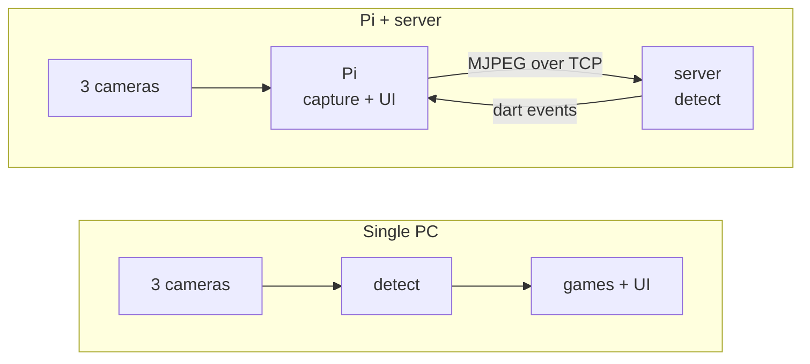

<div align="center">

# Treblotron

**Play darts. It keeps score.**

Point three cameras at a dartboard and Treblotron works out where every dart
landed — no mat, no sensors, no electronic board. Then it gives you games you
cannot play anywhere else.

[](LICENSE)
[](#)
[](docs/SETUP.md)
[](#)

[Get started](docs/SETUP.md) · [How it works](#how-it-works) · [Games](#the-games) · [Known issues](#known-issues)

</div>

<!--
  TODO: drop a screenshot or GIF in docs/images/ and uncomment.
  The strongest single asset for this page is a short clip of Dartfleet being
  played — darts landing, ships sinking. Second best is the calibration screen
  with three live camera previews.


-->

---

## Why

Automatic scoring already exists, and it is aimed at serious players: averages,
checkout percentages, tournament brackets. Treblotron is aimed at the other
evening — the one where four people are in a garage and nobody wants to do
arithmetic.

So accuracy matters only up to "it got the right treble", and the interesting
part is what a scoring dartboard lets you *play* once a computer is watching.

## The games

| | |
|---|---|
| **Dartfleet** | Hide a fleet on the board and sink your opponent's. Every dart is a shot; the board is the sea. Teams up to 3-a-side, adjustable ship sizes. |
| **X01** | 301 through 901, double-in and double-out options. The one everybody knows. |
| **Cricket** | 15s through bullseye, marks and points. |

More to come — original games are the point of the project, not a side effect.

## Getting started

Three ways to run it. **[Full setup guide →](docs/SETUP.md)**

<table>
<tr>
<td width="33%" valign="top">

### One PC
Cameras straight into a Windows machine, GPU does the rest.
**Simplest — start here.**

`Treblotron-*-Setup.exe`

</td>
<td width="33%" valign="top">

### Pi at the board
A Raspberry Pi runs the cameras and the screen; a PC on your network runs the
models.

`Treblotron-Server-*.exe` + `treblotron_*_arm64.deb`

</td>
<td width="33%" valign="top">

### No hardware
Clickable dartboard instead of cameras. Every game playable.

`Treblotron-Demo.zip`

</td>
</tr>
</table>

Whichever you pick, the step that matters is **calibration**: 40 clicked wire
intersections per camera, once, so the software knows where the board is. The
calibration screen names each point and marks it on a board diagram, so there
is no guessing which corner it means. It takes a few minutes and survives
forever unless a camera moves.

---

## How it works

Two deployment shapes, one detection pipeline. The same `detect` module runs in
both, so a dart scored remotely is scored by exactly the code that would have
scored it locally.

Detection itself is **two models** — a segmenter that finds dart pixels, and a
detector that turns three views of them into one board position. Everything
after that is not a third model but a question of *when* those two are run,
which is what the loop section covers.



### Step 1 — the segmenter


The board is discarded on purpose. Wires, numbers and lighting differ between
rigs and say nothing about where a dart is; removing them leaves a problem that
looks the same in any room. The warp does the other half — it folds in the
board's own rotation, so **20 sits at 12 o'clock in all three views** and every
camera agrees where a canonical point is. That is what makes a single shared
tip channel meaningful across three cameras.

One deliberate inaccuracy, visible in the zoomed panels above: **the mask is
wider than the dart at the tip.** A dart's point is polished steel, about a
tenth of its length, and projects to 2–4 pixels — frequently indistinguishable
from whatever is behind it, by reflection or just by colour. In the first crop
it fades into a cream segment several pixels before it actually ends; in the
last — a different dart, thrown into a black bed and further from the camera —
there is nothing to see at all, and the mask is the only thing that knows where
the dart stopped.

Training the segmenter on an exact silhouette would be training it to find
something that often is not visibly there, so the training masks union a
round-capped, tapered flare over the point instead — which is why the mask
alone reads as a rounded cap rather than a needle. The size was fitted against
hand-labelled data rather than chosen by eye: 2 px from the apex, real labels
run 9.0 px half-width against a pristine silhouette's 2.1, so without the flare
synthetic and real training data disagreed by about 4× at exactly the region
the tip decision depends on.

### Why three cameras


Before the model, some geometry — and it is the reason the previous section's
problem is solvable at all.

A dart sticks *out* of the board. Its tip is the only part of it touching the
plane the warp was solved for, so once warped, each camera puts the body
somewhere different — shaft and flight swing off in three directions — while all
three still agree on the tip. Overlay the silhouettes and they cross in one
place.

**No view has to show the steel.** The tip is never read off an image; it is
triangulated. Each silhouette is a ray that starts at the tip, the three rays
point different ways, and the only thing they share is where they begin — so the
crossing locates the point whether or not any camera could resolve it. That is
what rescues the case from the previous section, where the steel vanishes into a
dark segment, and it holds even when none of the three cameras can see it.

It is the flare that makes this safe rather than lucky. A mask that stopped short
of the tip would start its ray late and drag the crossing with it, which is why
the training masks err long.

**Darts also hide each other,** which is the other half of the same argument. A
dart is a rigid rod and a camera is roughly a pinhole, so a dart thrown later can
pass behind one already in the board — and it does so in *one* view while the
others see straight past. In the bottom row the third dart is cut clean in two by
an earlier one in `cam2` and is a single unbroken shape in `cam0`: same instant,
same dart, two different answers about what is there.

This is why the instance masks are per view rather than shared. A dart's
conditioning channel is what the segmenter gained minus what earlier darts
already claimed, so an occluded dart's channel genuinely has a hole in it, and
the training labels reproduce that hole rather than repairing it. Keeping the
views separate means the least-occluded one still carries a clean channel.

Both facts point the same way, and it is the reason the three streams are kept
apart until the funnel in the next section: merge them earlier and the one view
that can still see the tip — or the one that is not looking through another dart
— gets averaged away before anything can use it.

### Step 2 — the detector


Three things here are worth more than the channel counts.

**Every camera's stem gets 9 channels, not 3.** The packed input is 21 channels —
9 RGB, then 9 per-view instance masks camera-major, then 3 shared tip maps — and
it is split back out per camera before anything runs. Camera *i* is handed its
own 3 RGB, its own 3 instance masks, and *a copy of the same 3 tip maps*:

```
stage0 input, camera i  =  RGB[i]  +  instance[i]  +  tips
                            3ch        3ch           3ch   =  9ch
```

The masks are per view because a mask has to line up with the image the stem is
looking at. The tips are shared because a tip lies on the board plane and warps
to the same canonical point in all three views — which is what the stage 1 warp
bought. MobileNetV3's first conv is rebuilt from 3 inputs to 9 to accept this,
and it is the one part of the frozen stem left trainable, so the mask channels
can actually learn.

**The three views stay separate until the funnel.** Each runs through the same
frozen, ImageNet-pretrained stem — `stage0` to 16 channels at 360 × 360, then
`stage1` to 24 at 180 × 180 — and only then are they merged. Merging any earlier
throws away the parallax that lets three views agree on one point; merging later
costs depth everything downstream needs.

The funnel itself is two convolutions, not one: the three 24-channel streams
concatenate to 72, a 3 × 3 mixes them across views, and a 1 × 1 mixes them again,
both staying **72 wide**. It is a mixing block rather than a bottleneck — nothing
is thrown away merging the views, so what reaches the encoder carries three
views' worth of evidence rather than one. `stage2`'s entry convolution is widened
from 24 to 72 to take it.

**The conditioning enters twice.** Once packed into the input as above, and again
spliced into the two highest-resolution skips — the same 12 conditioning channels,
resampled — so the decoder is told which pixels are already spoken for at the
resolution where it makes that call.

### The loop — one pass per throw


This is the part that makes the conditioning channels necessary at all. The
figure is one real turn — three separate captures, taken as each dart landed —
and each frame is asked for exactly **one** dart, against the ones already
counted. So each heatmap has a single peak in it.

Nothing suppresses an already-counted dart except that feedback. There is no
tracker and no cross-frame suppression: the fourth column is the *same* frame as
the third, and the only thing that changed is that all three darts are now in the
conditioning. That alone takes the existence logit from +18.40 to −10.95, which
is how the detector knows the turn is over rather than being told to stop after
three.

**Where the per-dart masks come from.** The segmenter emits one blob of every
dart present, never a dart at a time — it cannot label instances, and neither can
anything else at runtime. It does not need to: darts arrive one at a time, so
whatever the mask gained since the last dart was counted *is* the new dart. Every
conditioning mask in the figure is that difference, and it is exactly the
derivation the model was trained on. Treblotron captures it the moment a dart is
confirmed, since the earlier mask is gone by the next cycle.

**A frozen frame has no "since",** which is what the bottom strip shows and why
replay is a different problem. Hand the first dart the whole mask and it claims
all three; the model then correctly reports nothing is left, and a three-dart
capture replays as one. `--replay` therefore takes the connected blob under each
detected tip instead
([`stillFrameConditioning`](detect/inc_public/detect/dart_detector.hpp#L58)),
which recovers all three darts in **78%** of a 40-frame sample against **95%**
using the stored labels. The frames it loses are ones where two silhouettes touch
and merge into a single component; no conditioning scheme separates those, only a
geometric split or a human. Replay is a diagnostic, and its score is a floor
rather than a measure of live accuracy.

> All three figures are generated from the shipped ONNX models by
> `scripts/make_model_figures.py`, running over one real labelled frame.
> Regenerate them after a re-export rather than editing the images.

<details>
<summary><b>The 21-channel input contract</b></summary>

| channels | contents |
|---|---|
| 0–8 | 3 cameras × RGB, camera-major, masked by segmentation |
| 9–17 | per-dart masks, camera-major: `9 + cam*3 + slot` |
| 18–20 | per-dart tip Gaussian (σ=5), one per slot, shared across cameras |

A slot's mask and its tip channel describe the same dart, and the pairing is
load-bearing — a mask says where a dart is, not which end is the point.

Thin rims around a dart that has not moved, and holes where a later dart passes
behind an earlier one, are both expected. The model was trained with them and
they should not be cleaned up.

**The sidecar.** `multicam_unet_ar.cond.json` ships beside the ONNX and names
the layout that export expects. It is checked before anything loads:

```
AR conditioning: instance_v1 (21 channels, sigma 5)
```

That check exists because the failure it prevents is invisible. A 10-channel and
a 21-channel export share a file name, output shapes and node names; feed one
the other's conditioning and it still runs, still emits peaks, and only accuracy
says otherwise — which is indistinguishable from a bad camera angle until
someone measures it. A stale segmentation model hid exactly that way for three
months.

</details>

### Accuracy

The shipped detector, on a held-out real test set of **210 throws** — never
trained on, split by throw so no frame of a turn leaks across:

| | |
|---|---|
| **F1** | **98.9%** |
| missed detections | **0** |
| phantom darts | **0** |
| remaining errors | 4, all pure localisation |
| worst error | **8 px** |

A match counts only within 5 px — **2.9 mm** on the board — which is far tighter
than any scoring boundary, so an "error" here is usually still the right score.
Every one of the four failures is under 20 px, meaning there is no case where the
model found the wrong dart or missed one outright.

Broken out by how close the new dart lands to one already counted — the axis
per-instance conditioning was built to fix:

| distance to nearest known dart | targets | recall |
|---|---|---|
| 0–20 px | 15 | 93.3% |
| 20–40 px | 19 | 100% |
| 40–80 px | 56 | 100% |
| > 80 px | 194 | 99.0% |

Across the train and test splits together — **1 423 targets** — there are zero
missed detections and zero errors over 20 px.

<details>
<summary>Caveats worth stating</summary>

- The split reshuffled between this run and the earlier baselines, so the
  progression from the 94.1% dot baseline is **strong evidence but not a clean
  A/B**. On the overlapping throws, 7 of 9 baseline failures are fixed and 2 new
  ones appeared.
- The final column includes label corrections: reviewing the ranked failure list
  found the model right and the label wrong in several cases.
- Real is genuinely harder than synthetic — the same model scores 98.2% on
  synthetic training data against 96.3% on real.
- This measures the **model**, on pre-warped frames with known board transforms.
  It is not an end-to-end measurement of the installed system, which also depends
  on your calibration and camera placement.

</details>

The C++ side has its own much smaller replay fixture (18 labelled tips, mean
1.8 px) that exists to catch packing and calibration regressions rather than to
measure accuracy — see the loop section on why a frozen frame scores lower than
live play.

### Speed

On a Radeon RX 7900 XT, one full cycle — segmentation, autoregressive detector,
both hand-detection passes:

| step | time |
|---|---|
| JPEG decode, 3 cameras concurrent | 3.7 ms |
| detect + reply | 23.6 ms |
| **total** | **27.3 ms → 36.6 Hz** |

That clears the 30 Hz the cameras run at, so the sensors are the cap. Send-to-detection
latency is 30 ms median. On CPU the same cycle takes 248 ms (~4 Hz), which still
plays but feels it.

<details>
<summary><b>How the client and server stay in step</b></summary>

Transport is plain TCP, one connection, carrying both control messages and
video: a 12-byte little-endian header in front of each typed message. No RTP,
no codec, no container.

Video is discrete JPEG stills. The UVC cameras already deliver MJPEG, so the
client **forwards the sensor's own bytes untouched** — no decode, no re-encode,
no second generation of compression loss between sensor and model. Nothing is
decoded on the Pi unless a preview screen actually asks for pixels.

The client streams continuously and the server always scores the newest set it
has. A reader thread drains the socket into a **one-slot, newest-wins mailbox**
and re-credits the client the instant a set comes off the wire, while inference
runs on another thread and takes whatever is freshest when it becomes free.

```
cycle     = max(transfer, server work)    not  transfer + server work
staleness = one transfer                  not  one server cycle
```

Roughly 165–270 KB per 3-camera cycle; 41–67 Mbit/s at 30 Hz. Unremarkable for
Wi-Fi 5/6, trivial over Ethernet. A slower link yields fewer cycles per second
rather than a growing backlog of stale frames.

**The Pi runs no models at all.** Its only jobs are capture, forward, and act on
the dart events that come back.

</details>

---

## Known issues

Honest list for a first release:

- **One board per server.** The detector holds one stateful pipeline, so a
  second client is told the server is busy and retries. Fine for a single
  setup; not a shortcut you can work around.
- **Jetson / TensorRT is unsupported.** The backend still compiles, but it has
  never been built against a real TensorRT and is not part of a release.
- **MJPEG pass-through is unverified on real V4L2 hardware.** If a driver
  ignores `CAP_PROP_CONVERT_RGB` the client falls back to re-encoding, which
  costs CPU on the Pi but works.
- **No prebuilt Raspberry Pi package.** Build it once from source; see
  [docs/SETUP.md](docs/SETUP.md).
- **Calibration is 120 clicks.** It is the honest cost of not requiring special
  hardware, but it is the least pleasant part of setup.

---

## Building from source

<details>
<summary><b>Presets, options and the build matrix</b></summary>

Configurations are named presets:

```bash
cmake --preset app-local-windows && cmake --build build-app-local-windows  # single PC
cmake --preset server-directml   && cmake --build build-server-directml    # inference server (GPU)
cmake --preset server-cpu        && cmake --build build-server-cpu         # inference server (CPU)
cmake --preset app-network       && cmake --build build-app-network        # Raspberry Pi client
cmake --preset app-sim           && cmake --build build                    # dev: clickable dartboard
cmake --preset app-demo          && cmake --build build-app-demo           # release build of the demo
```

Two independent options drive everything:

| option | values | meaning |
|---|---|---|
| `TREBLOTRON_VISION_SOURCE` | `sim`, `local`, `network` | where dart events come from |
| `TREBLOTRON_INFER_BACKEND` | `none`, `directml`, `cpu`, `tensorrt` | what executes a forward pass |

They are separate because one backend serves two binaries: the game detecting
locally, and the headless server detecting on behalf of a remote client.

| backend | runs on | notes |
|---|---|---|
| `directml` | any DirectX 12 GPU, Windows | AMD, Intel and NVIDIA alike. Fetches ONNX Runtime at configure time. |
| `cpu` | anything | OpenCV DNN. No extra dependency; the fallback that always works. |
| `tensorrt` | NVIDIA CUDA | Unsupported — see Known issues. |
| `none` | — | No models compiled in (sim and Pi-client builds). |

Toolchain: MSYS2 mingw64 g++ with C++23, CMake 3.22+, Ninja. Expect the first
build to take a while — OpenCV is a submodule and is compiled from source.

**Releases.** `scripts/release.ps1` builds every artifact, checks each binary
starts with the toolchain off `PATH`, and collects the results in `dist/`.
Needs NSIS for the two installers.

</details>

<details>
<summary><b>Where DirectML comes from</b></summary>

`server-directml` downloads ONNX Runtime (~12 MB) into
`external_libs/onnxruntime` on first configure. **`DirectML.dll` is not fetched
by default** — Windows ships one and the loader finds it, which needs no
download and adds no redistribution obligation.

The catch is that the inbox copy tracks the OS version: an older Windows 10 can
carry a DirectML too old for the pinned ONNX Runtime, in which case the backend
reports itself as `ONNX Runtime (CPU — DirectML unavailable)` and runs about
thirteen times slower. `-DTREBLOTRON_FETCH_DIRECTML=ON` ships the
redistributable instead, at a one-time ~200 MB download for one 18 MB DLL.

Note that Windows also ships its **own** `onnxruntime.dll` in System32. It is
too old for this build, so the DLL we ship must sit beside the executable —
the installer handles this, and the version check refuses to start rather than
misbehave if it ever does not.

</details>

<details>
<summary><b>Module layout</b></summary>

| module | role |
|---|---|
| `detect/` | models, inference backends, the shared detection pipeline |
| `net/` | socket shim + client/server wire protocol |
| `server/` | headless inference server |
| `vision/` | cameras and the vision-source implementations |
| `frame/` `game_lib/` `games/` `players/` `dart/` `debug/` | the game itself |

A module is a directory with public headers in `<mod>/inc_public/<mod>/` and
flat implementation files in `<mod>/*.cpp`.

</details>

---

## Credits

**Libraries** — [SDL 3](https://www.libsdl.org/), [SDL_ttf](https://github.com/libsdl-org/SDL_ttf),
[SDL_image](https://github.com/libsdl-org/SDL_image) (zlib) ·
[spdlog](https://github.com/gabime/spdlog), [Flecs](https://github.com/SanderMertens/flecs) (MIT) ·
[OpenCV](https://opencv.org/) (Apache 2.0) ·
[ONNX Runtime](https://github.com/microsoft/onnxruntime) (MIT, © Microsoft) ·
[DirectML](https://aka.ms/DirectML) (proprietary — Microsoft Software License Terms;
not redistributed by default)

**Assets** — [Roboto](https://fonts.google.com/specimen/Roboto) by Google (Apache 2.0) ·
[Input Prompts](https://kenney.nl/assets/input-prompts) by [Kenney](https://www.kenney.nl) (CC0)

**Models** are trained and exported from a companion repository and ship under
the same MIT licence as the rest of this project.

Licence texts for everything shipped are installed alongside the program under
`licenses/`.

---

<div align="center">
<sub>MIT licensed · <a href="docs/SETUP.md">Setup guide</a></sub>
</div>
