<div align="center">

# Treblotron

**Play darts. It keeps score.**

Point three cameras at a dartboard and Treblotron works out where every dart
landed — no mat, no sensors, no electronic board. Then it gives you games you
cannot play anywhere else.

[](LICENSE)
[](#)
[](docs/SETUP.md)
[](#)

[Get started](docs/SETUP.md) · [How it works](#how-it-works) · [Games](#the-games) · [Known issues](#known-issues)

</div>

<table>
<tr>
<td width="33%">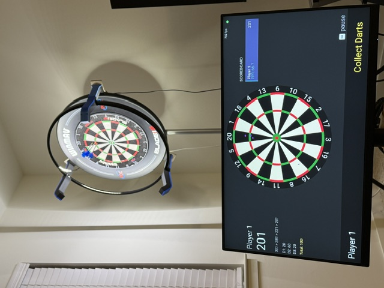</td>
<td width="33%">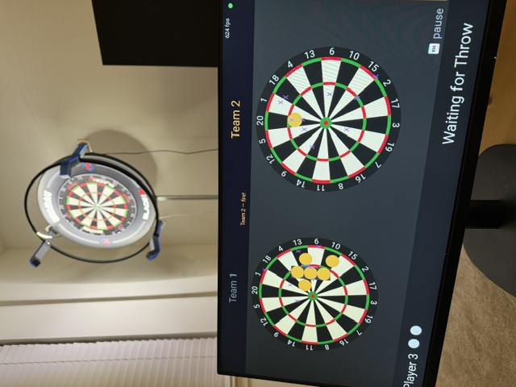</td>
<td width="33%">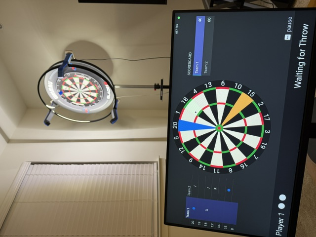</td>
</tr>
</table>

<div align="center"><sub>Three cameras on a ring, an ordinary bristle board, and whatever screen you have. No electronics in the board.</sub></div>

---

## Why

Apps that score darts already exist. Most are built for serious players:
averages, checkout percentages, tournament brackets.

Treblotron points the other way. Tracking statistics matters less here than
what you can play once a computer is watching the board, so accuracy only has
to be good enough to get the right treble. The games are the point.

## The games

<table>
<tr>
<td width="33%" valign="top">
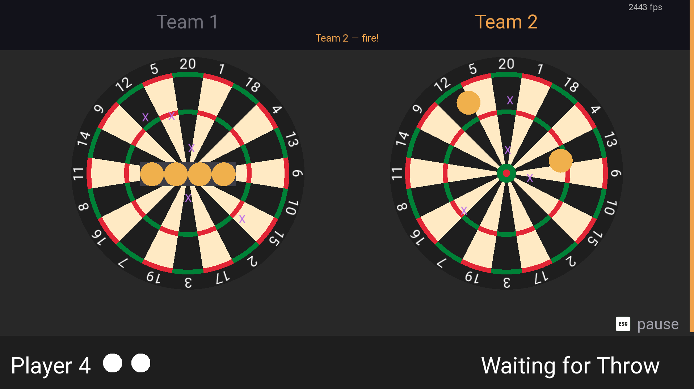

### Dartfleet
Hide a fleet on the board and sink your opponent's. Every dart is a shot.
Teams up to 3-a-side, and you can change the ship sizes.

</td>
<td width="33%" valign="top">
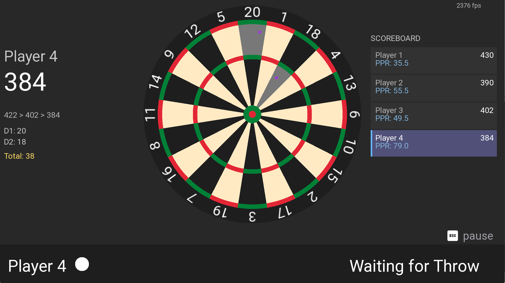

### X01
301 through 901, with double-in and double-out. The one everybody knows,
plus points-per-round for each player.

</td>
<td width="33%" valign="top">
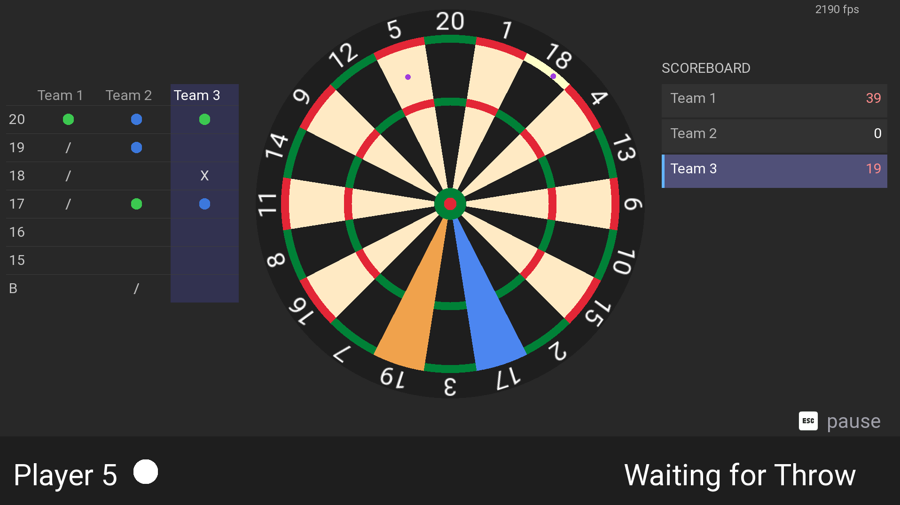

### Cricket
15s through bullseye, marks and points. Up to three teams.

</td>
</tr>
</table>

Dartfleet and Cricket both have a teams mode, so an evening with six people
does not turn into six separate scores. X01 is per player.

## Planned

- **Mini Golf.** Another original game, in the same vein as Dartfleet.
- **A data collection mode.** Gathering training data is more tedious than it
  needs to be, and the app is the natural place to do it from.
- **Correcting a throw in game.** When the detector gets one wrong there is
  currently no way to fix it without leaving the game.

The games are the reason the project exists, not an extra on top of it.

## Getting started

Three ways to run it. **[Full setup guide →](docs/SETUP.md)**

<table>
<tr>
<td width="33%" valign="top">

### One PC
Cameras straight into a Windows machine, GPU does the rest.
**Simplest — start here.**

`Treblotron-*-Setup.exe`

</td>
<td width="33%" valign="top">

### Pi at the board
A Raspberry Pi runs the cameras and the screen; a PC on your network runs the
models.

`Treblotron-Server-*.exe` + `treblotron_*_arm64.deb`

</td>
<td width="33%" valign="top">

### No hardware
Clickable dartboard instead of cameras. Every game playable.

`Treblotron-Demo.zip`

</td>
</tr>
</table>

Whichever you pick, you have to calibrate once. That means clicking 40 wire
intersections per camera so the software knows where the board is. The screen
names each point and shows it on a diagram, so you are not guessing which
corner it means. It takes a few minutes, and you only do it again if a camera
moves.

Menus and games take a keyboard or a controller. Controllers are picked up
while the app is running, and the on-screen button prompts switch to match
whichever you used last, so a box by the board can be driven with a gamepad and
nothing else.

The cameras have to be mounted somewhere. The rig in the photos above is the
[Autodarts DIY](https://autodarts.diy/3d-printing/Autodarts/) camera mount:
three 3D-printed arms holding the cameras at 120° around the board, with an LED
ring for even lighting. Autodarts is a separate scoring project, but the
mounting problem is the same one and their community has already worked it out.
Any mount that gets three cameras looking at the board from different angles
will do.

---

## How it works

There are two ways to deploy it and one detection pipeline. The same `detect`
module runs in both, so a dart scored on the server goes through the same code
that would have scored it locally.

Detection is two models. A segmenter finds dart pixels, and a detector turns
three views of those pixels into one board position. There is no third model.
The rest is about when those two get run, which is the loop section below.

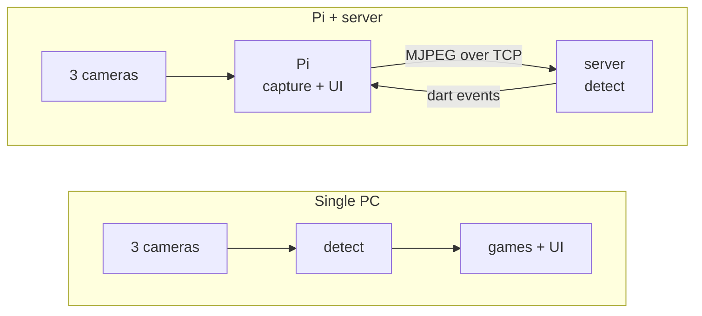

### Step 1 — the segmenter

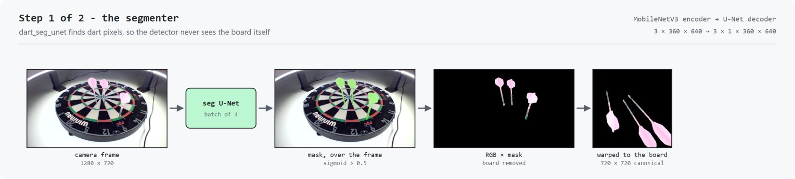

Throwing the board away is deliberate. Wires, numbers and lighting are
different on every rig and none of it says where a dart is. Take it out and the
problem looks the same in any room.

The warp handles the rest. It folds in the board's own rotation, so **20 sits at
12 o'clock in all three views**. Every camera then agrees on where a given point
is. That matters later, when all three share one tip channel.

The mask is wider than the dart at the tip, on purpose.

A dart's point is polished steel and about a tenth of its length. It comes out
as 2 to 4 pixels, and often you cannot tell it apart from whatever is behind it,
either by reflection or just by colour. In the first crop below it fades into a
cream segment a few pixels before it actually ends. In the last one, a different
dart thrown into a black bed and further from the camera, there is nothing to
see at all.

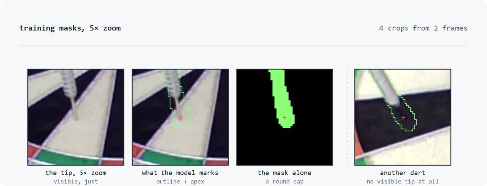

Training on the exact silhouette would mean training the model to find
something that often is not visible. So the training masks add a round-capped,
tapered flare over the point. That is why the mask on its own looks like a
rounded cap and not a needle.

The size was fitted to hand-labelled data instead of picked by eye. Measured
2 px from the apex, real labels run 9.0 px half-width and a clean silhouette
only 2.1. Without the flare, synthetic and real training data disagreed by
about 4× right where the tip decision happens.

### Why three cameras

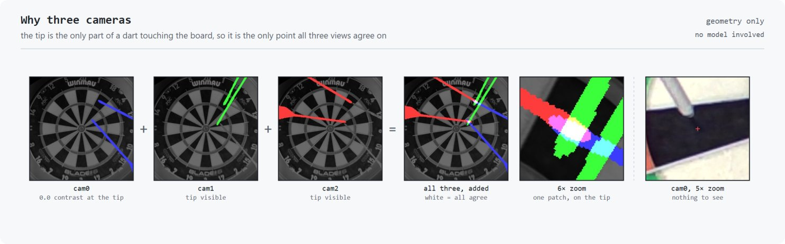

This is geometry, not model. It is also why the problem in the last section is
solvable.

A dart sticks *out* of the board. The tip is the only part touching the plane
the warp was solved for. So once warped, each camera puts the body somewhere
different, with the shaft and flight swinging off in three directions, but all
three still agree on the tip. Overlay the silhouettes and they cross in one
place.

So no view has to show the steel. The tip is never read off an image, it is
triangulated. Each silhouette is a ray starting at the tip, the three rays point
different ways, and the only thing they share is where they start. The crossing
finds the point whether or not a camera could resolve it, and it still works
when none of the three can see it.

The flare is what makes that safe. A mask that stopped short of the tip would
start its ray late and pull the crossing with it, so the training masks err
long.

Darts also hide each other. A dart is a rigid rod and a camera is roughly a
pinhole, so a dart thrown later can pass behind one already in the board. It
does that in one view while the others see straight past.

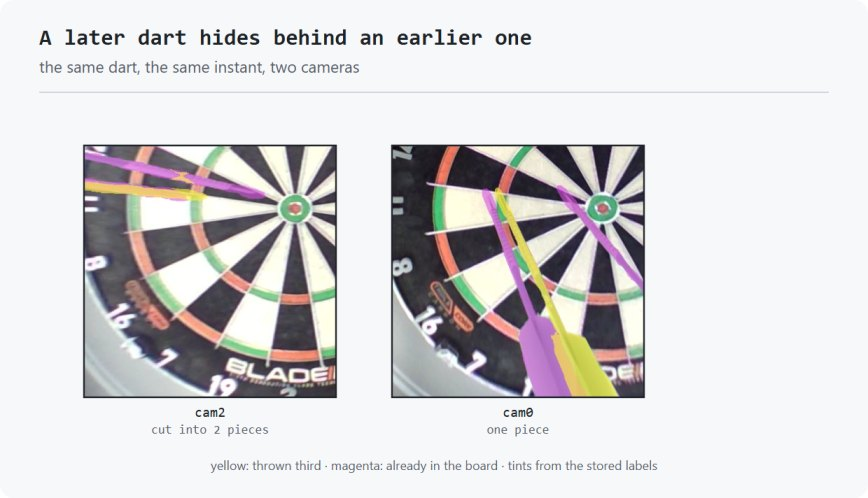

Above, the third dart is cut in two by an earlier one in `cam2`. In `cam0` it is
a single unbroken shape. Same instant, same dart, two different answers.

This is why the instance masks are per view instead of shared. A dart's
conditioning channel is what the segmenter gained minus what earlier darts
already claimed, so an occluded dart's channel has a hole in it. The training
labels keep that hole rather than patching it, and the least-occluded view still
carries a clean channel.

Both of these are why the three streams stay apart until the funnel in the next
section. Merge them earlier and the one view that can still see the tip gets
averaged away with the rest.

### Step 2 — the detector

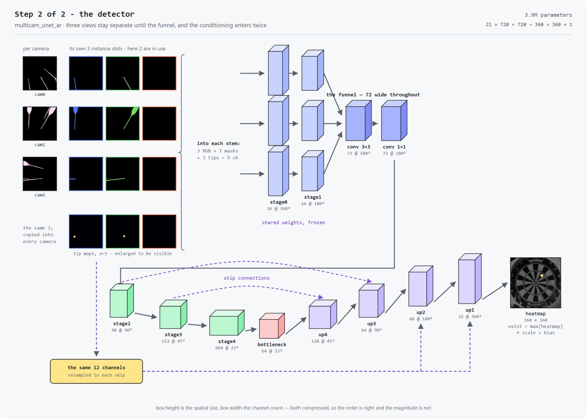

Three things matter more than the channel counts.

**Each camera's stem gets 9 channels, not 3.** The packed input is 21 channels:
9 RGB, then 9 per-view instance masks camera-major, then 3 shared tip maps. It
gets split back out per camera before anything runs. Camera *i* is handed its
own 3 RGB, its own 3 instance masks, and a copy of the same 3 tip maps:

```
stage0 input, camera i  =  RGB[i]  +  instance[i]  +  tips
                            3ch        3ch           3ch   =  9ch
```

The masks are per view because a mask has to line up with the image the stem is
looking at. The tips are shared because a tip sits on the board plane, so it
warps to the same canonical point in all three views. That is what the step 1
warp bought. MobileNetV3's first conv is rebuilt from 3 inputs to 9 to take
this, and it is the one part of the frozen stem left trainable so the mask
channels can learn.

**The three views stay separate until the funnel.** Each one runs through the
same frozen, ImageNet-pretrained stem: `stage0` to 16 channels at 360 × 360,
then `stage1` to 24 at 180 × 180. Only then are they merged. Merge any earlier
and you throw away the parallax that lets three views agree on a point. Merge
later and everything downstream loses depth.

The funnel is two convolutions, not one. The three 24-channel streams
concatenate to 72, a 3 × 3 mixes them across views, and a 1 × 1 mixes them
again. Both stay **72 wide**, so it is a mixing block and not a bottleneck.
Nothing is thrown away merging the views, and the encoder gets three views'
worth of evidence instead of one. `stage2`'s entry convolution is widened from
24 to 72 to take it.

**The conditioning enters twice.** Once packed into the input as above, and
again spliced into the two highest-resolution skips, resampled but the same 12
channels. That way the decoder knows which pixels are already spoken for at the
resolution where it decides.

### The loop — one pass per throw

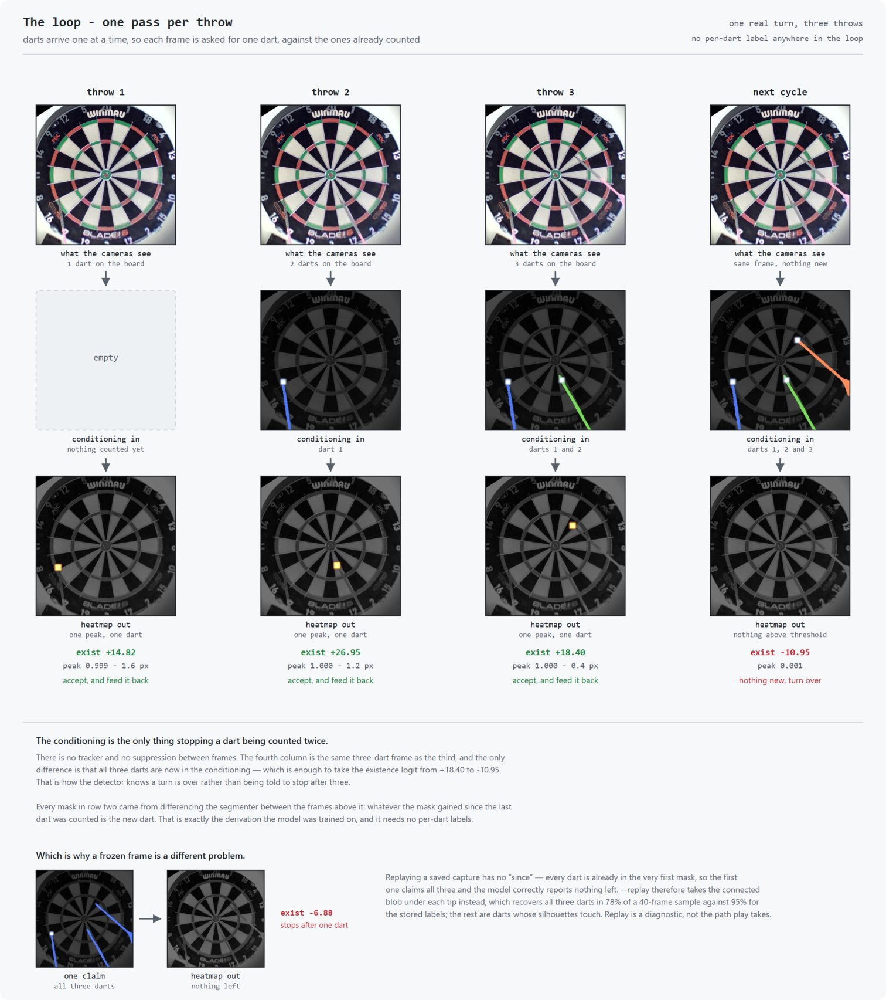

This is what the conditioning channels are for. The figure is one real turn,
three separate captures taken as each dart landed. Each frame is asked for
**one** dart, against the ones already counted, so each heatmap has a single
peak in it.

Nothing suppresses an already-counted dart except that feedback. There is no
tracker and no cross-frame suppression. The fourth column is the *same* frame as
the third and the only difference is that all three darts are now in the
conditioning, which takes the existence logit from +18.40 to −10.95. That is how
the detector knows the turn is over, instead of just stopping after three.

**Where the per-dart masks come from.** The segmenter gives one blob of every
dart present, never a dart at a time. It cannot label instances and nothing else
at runtime can either. It does not need to. Darts arrive one at a time, so
whatever the mask gained since the last dart was counted *is* the new dart.
Every conditioning mask in the figure is that difference, and it is the same
derivation the model was trained on. Treblotron grabs it the moment a dart is
confirmed, because the earlier mask is gone by the next cycle.

**A frozen frame has no "since",** which is why replay is a different problem.
Hand the first dart the whole mask and it claims all three; the model then
correctly reports nothing is left, and a three-dart capture replays as one.

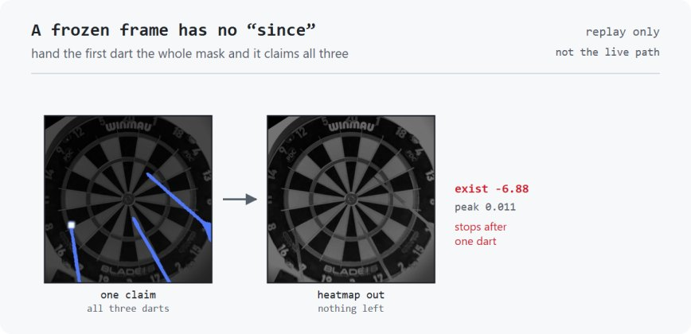

So `--replay` takes the connected blob under each detected tip instead
([`stillFrameConditioning`](detect/inc_public/detect/dart_detector.hpp#L58)).
That recovers all three darts in **78%** of a 40-frame sample, against **95%**
using the stored labels. The ones it loses are frames where two silhouettes
touch and merge into one component. No conditioning scheme separates those, only
a geometric split or a person. Replay is a diagnostic, so treat its score as a
floor rather than a measure of live accuracy.

> Every figure above is generated from the shipped ONNX models by
> `scripts/make_model_figures.py`, running over one real labelled frame.
> Regenerate them after a re-export rather than editing the images.

<details>
<summary><b>The 21-channel input contract</b></summary>

| channels | contents |
|---|---|
| 0–8 | 3 cameras × RGB, camera-major, masked by segmentation |
| 9–17 | per-dart masks, camera-major: `9 + cam*3 + slot` |
| 18–20 | per-dart tip Gaussian (σ=5), one per slot, shared across cameras |

A slot's mask and its tip channel describe the same dart, and the pairing is
load-bearing — a mask says where a dart is, not which end is the point.

Thin rims around a dart that has not moved, and holes where a later dart passes
behind an earlier one, are both expected. The model was trained with them and
they should not be cleaned up.

**The sidecar.** `multicam_unet_ar.cond.json` ships beside the ONNX and names
the layout that export expects. It is checked before anything loads:

```
AR conditioning: instance_v1 (21 channels, sigma 5)
```

That check exists because the failure it prevents is invisible. A 10-channel and
a 21-channel export share a file name, output shapes and node names; feed one
the other's conditioning and it still runs, still emits peaks, and only accuracy
says otherwise — which is indistinguishable from a bad camera angle until
someone measures it. A stale segmentation model hid exactly that way for three
months.

</details>

### Accuracy

The shipped detector on a held-out real test set of **210 throws**. Never
trained on, and split by throw so no frame of a turn leaks across:

| | |
|---|---|
| **F1** | **98.9%** |
| missed detections | **0** |
| phantom darts | **0** |
| remaining errors | 4, all pure localisation |
| worst error | **8 px** |

A match only counts within 5 px, which is **2.9 mm** on the board. That is much
tighter than any scoring boundary, so an "error" here usually still scores
right. All four failures are under 20 px, so there is no case where the model
found the wrong dart or missed one outright.

Broken out by how close the new dart lands to one already counted, which is the
axis per-instance conditioning was built to fix:

| distance to nearest known dart | targets | recall |
|---|---|---|
| 0–20 px | 15 | 93.3% |
| 20–40 px | 19 | 100% |
| 40–80 px | 56 | 100% |
| > 80 px | 194 | 99.0% |

Across the train and test splits together, **1 423 targets**, there are zero
missed detections and zero errors over 20 px.

<details>
<summary>Caveats worth stating</summary>

- The split reshuffled between this run and the earlier baselines, so the
  progression from the 94.1% dot baseline is **strong evidence but not a clean
  A/B**. On the overlapping throws, 7 of 9 baseline failures are fixed and 2 new
  ones appeared.
- The final column includes label corrections: reviewing the ranked failure list
  found the model right and the label wrong in several cases.
- Real is harder than synthetic. The same model scores 98.2% on synthetic
  training data against 96.3% on real.
- This measures the **model**, on pre-warped frames with known board transforms.
  It is not an end-to-end measurement of the installed system, which also depends
  on your calibration and camera placement.

</details>

The C++ side has its own much smaller replay fixture (18 labelled tips, mean
1.8 px) that exists to catch packing and calibration regressions rather than to
measure accuracy — see the loop section on why a frozen frame scores lower than
live play.

### Speed

On a Radeon RX 7900 XT, one full cycle — segmentation, autoregressive detector,
both hand-detection passes:

| step | time |
|---|---|
| JPEG decode, 3 cameras concurrent | 3.7 ms |
| detect + reply | 23.6 ms |
| **total** | **27.3 ms → 36.6 Hz** |

That clears the 30 Hz the cameras run at, so the sensors are the cap. Send-to-detection
latency is 30 ms median. On CPU the same cycle takes 248 ms (~4 Hz), which still
plays but feels it.

<details>
<summary><b>How the client and server stay in step</b></summary>

Transport is plain TCP, one connection, carrying both control messages and
video: a 12-byte little-endian header in front of each typed message. No RTP,
no codec, no container.

Video is discrete JPEG stills. The UVC cameras already deliver MJPEG, so the
client **forwards the sensor's own bytes untouched** — no decode, no re-encode,
no second generation of compression loss between sensor and model. Nothing is
decoded on the Pi unless a preview screen actually asks for pixels.

The client streams continuously and the server always scores the newest set it
has. A reader thread drains the socket into a **one-slot, newest-wins mailbox**
and re-credits the client the instant a set comes off the wire, while inference
runs on another thread and takes whatever is freshest when it becomes free.

```
cycle     = max(transfer, server work)    not  transfer + server work
staleness = one transfer                  not  one server cycle
```

Roughly 165–270 KB per 3-camera cycle; 41–67 Mbit/s at 30 Hz. Unremarkable for
Wi-Fi 5/6, trivial over Ethernet. A slower link yields fewer cycles per second
rather than a growing backlog of stale frames.

**The Pi runs no models at all.** Its only jobs are capture, forward, and act on
the dart events that come back.

</details>

---

## Known issues

Honest list for a first release:

- **One board per server.** The detector holds one stateful pipeline, so a
  second client is told the server is busy and retries. Fine for a single
  setup; not a shortcut you can work around.
- **Jetson / TensorRT is unsupported.** The backend still compiles, but it has
  never been built against a real TensorRT and is not part of a release.
- **MJPEG pass-through is unverified on real V4L2 hardware.** If a driver
  ignores `CAP_PROP_CONVERT_RGB` the client falls back to re-encoding, which
  costs CPU on the Pi but works.
- **Calibration is 120 clicks.** It is the honest cost of not requiring special
  hardware, but it is the least pleasant part of setup.

---

## Building from source

<details>
<summary><b>Presets, options and the build matrix</b></summary>

Configurations are named presets:

```bash
cmake --preset app-local-windows && cmake --build build-app-local-windows  # single PC
cmake --preset server-directml   && cmake --build build-server-directml    # inference server (GPU)
cmake --preset server-cpu        && cmake --build build-server-cpu         # inference server (CPU)
cmake --preset app-network       && cmake --build build-app-network        # Raspberry Pi client
cmake --preset app-sim           && cmake --build build                    # dev: clickable dartboard
cmake --preset app-demo          && cmake --build build-app-demo           # release build of the demo
```

Two independent options drive everything:

| option | values | meaning |
|---|---|---|
| `TREBLOTRON_VISION_SOURCE` | `sim`, `local`, `network` | where dart events come from |
| `TREBLOTRON_INFER_BACKEND` | `none`, `directml`, `cpu`, `tensorrt` | what executes a forward pass |

They are separate because one backend serves two binaries: the game detecting
locally, and the headless server detecting on behalf of a remote client.

| backend | runs on | notes |
|---|---|---|
| `directml` | any DirectX 12 GPU, Windows | AMD, Intel and NVIDIA alike. Fetches ONNX Runtime at configure time. |
| `cpu` | anything | OpenCV DNN. No extra dependency; the fallback that always works. |
| `tensorrt` | NVIDIA CUDA | Unsupported — see Known issues. |
| `none` | — | No models compiled in (sim and Pi-client builds). |

Toolchain: MSYS2 mingw64 g++ with C++23, CMake 3.22+, Ninja. Expect the first
build to take a while — OpenCV is a submodule and is compiled from source.

**Releases.** A release is four artifacts:

| artifact | built from |
|---|---|
| `Treblotron-*-Setup.exe` | `app-local-windows` |
| `Treblotron-Server-*-Setup.exe` | `server-directml` |
| `Treblotron-Demo-*.zip` | `app-demo` |
| `treblotron_*_arm64.deb` | `app-network`, built on the Pi |

`scripts/release.ps1` builds the three Windows ones, checks each installed tree
resolves every DLL it needs, and collects the results in `dist/`. It needs NSIS
for the two installers. The Pi package is built on an arm64 machine with
`cpack`, because there is no cross-compiler here; see
[docs/SETUP.md](docs/SETUP.md).

</details>

<details>
<summary><b>Where DirectML comes from</b></summary>

`server-directml` downloads ONNX Runtime (~12 MB) into
`external_libs/onnxruntime` on first configure. **`DirectML.dll` is not fetched
by default** — Windows ships one and the loader finds it, which needs no
download and adds no redistribution obligation.

The catch is that the inbox copy tracks the OS version: an older Windows 10 can
carry a DirectML too old for the pinned ONNX Runtime, in which case the backend
reports itself as `ONNX Runtime (CPU — DirectML unavailable)` and runs about
thirteen times slower. `-DTREBLOTRON_FETCH_DIRECTML=ON` ships the
redistributable instead, at a one-time ~200 MB download for one 18 MB DLL.

Note that Windows also ships its **own** `onnxruntime.dll` in System32. It is
too old for this build, so the shipped DLL has to sit beside the executable —
the installer handles this, and the version check refuses to start rather than
misbehave if it ever does not.

</details>

<details>
<summary><b>Module layout</b></summary>

| module | role |
|---|---|
| `detect/` | models, inference backends, the shared detection pipeline |
| `net/` | socket shim + client/server wire protocol |
| `server/` | headless inference server |
| `vision/` | cameras and the vision-source implementations |
| `frame/` `game_lib/` `games/` `players/` `dart/` `debug/` | the game itself |

A module is a directory with public headers in `<mod>/inc_public/<mod>/` and
flat implementation files in `<mod>/*.cpp`.

</details>

---

## Credits

**Libraries** — [SDL 3](https://www.libsdl.org/), [SDL_ttf](https://github.com/libsdl-org/SDL_ttf),
[SDL_image](https://github.com/libsdl-org/SDL_image) (zlib) ·
[spdlog](https://github.com/gabime/spdlog), [Flecs](https://github.com/SanderMertens/flecs) (MIT) ·
[OpenCV](https://opencv.org/) (Apache 2.0) ·
[ONNX Runtime](https://github.com/microsoft/onnxruntime) (MIT, © Microsoft) ·
[DirectML](https://aka.ms/DirectML) (proprietary — Microsoft Software License Terms;
not redistributed by default)

**Assets** — [Roboto](https://fonts.google.com/specimen/Roboto) by Google (Apache 2.0) ·
[Input Prompts](https://kenney.nl/assets/input-prompts) by [Kenney](https://www.kenney.nl) (CC0)

**Hardware** — the camera mount in the photos is the
[Autodarts DIY](https://autodarts.diy/3d-printing/Autodarts/) 3D-printed
design. Autodarts is a separate dart-scoring project and Treblotron is not
affiliated with it; only the mount is shared.

**Models** are trained and exported from a companion repository, which is not
public yet. They ship under the same MIT licence as the rest of this project.

Licence texts for everything shipped are installed alongside the program under
`licenses/`.

---

<div align="center">
<sub>MIT licensed · <a href="docs/SETUP.md">Setup guide</a></sub>
</div>
