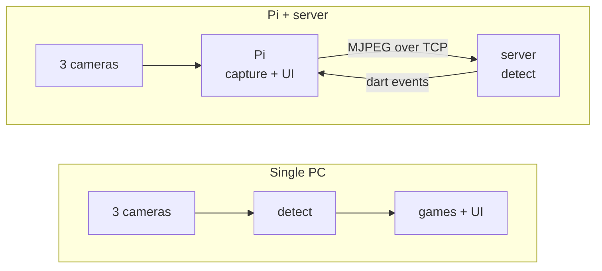
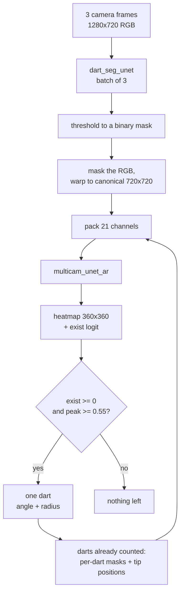

<div align="center">

# Dartmatic

**Play darts. It keeps score.**

Point three cameras at a dartboard and Dartmatic works out where every dart
landed — no mat, no sensors, no electronic board. Then it gives you games you
cannot play anywhere else.

[](LICENSE)
[](#)
[](docs/SETUP.md)
[](#)

[Get started](docs/SETUP.md) · [How it works](#how-it-works) · [Games](#the-games) · [Known issues](#known-issues)

</div>

<!--
  TODO: drop a screenshot or GIF in docs/images/ and uncomment.
  The strongest single asset for this page is a short clip of Dartfleet being
  played — darts landing, ships sinking. Second best is the calibration screen
  with three live camera previews.


-->

---

## Why

Automatic scoring already exists, and it is aimed at serious players: averages,
checkout percentages, tournament brackets. Dartmatic is aimed at the other
evening — the one where four people are in a garage and nobody wants to do
arithmetic.

So accuracy matters only up to "it got the right treble", and the interesting
part is what a scoring dartboard lets you *play* once a computer is watching.

## The games

| | |
|---|---|
| **Dartfleet** | Hide a fleet on the board and sink your opponent's. Every dart is a shot; the board is the sea. Teams up to 3-a-side, adjustable ship sizes. |
| **X01** | 301 through 901, double-in and double-out options. The one everybody knows. |
| **Cricket** | 15s through bullseye, marks and points. |

More to come — original games are the point of the project, not a side effect.

## Getting started

Three ways to run it. **[Full setup guide →](docs/SETUP.md)**

<table>
<tr>
<td width="33%" valign="top">

### One PC
Cameras straight into a Windows machine, GPU does the rest.
**Simplest — start here.**

`Dartmatic-*-Setup.exe`

</td>
<td width="33%" valign="top">

### Pi at the board
A Raspberry Pi runs the cameras and the screen; a PC on your network runs the
models.

`Dartmatic-Server-*.exe` + build on the Pi

</td>
<td width="33%" valign="top">

### No hardware
Clickable dartboard instead of cameras. Every game playable.

`Dartmatic-Demo.zip`

</td>
</tr>
</table>

Whichever you pick, the step that matters is **calibration**: 40 clicked wire
intersections per camera, once, so the software knows where the board is.
It takes a few minutes and survives forever unless a camera moves.

---

## How it works

Two deployment shapes, one detection pipeline. The same `detect` module runs in
both, so a dart scored remotely is scored by exactly the code that would have
scored it locally.



### The detection pipeline

One forward pass finds **one** dart. To find the next it is told which darts are
already accounted for — not just where their tips are, but which pixels belong
to them.



A dart's own pixels are recoverable only by differencing the segmenter across
time: whatever the mask gained since the last dart was counted *is* the new
dart. Dartmatic captures that difference the moment a dart is confirmed,
because the earlier mask is gone by the next cycle.

<details>
<summary><b>The 21-channel input contract</b></summary>

| channels | contents |
|---|---|
| 0–8 | 3 cameras × RGB, camera-major, masked by segmentation |
| 9–17 | per-dart masks, camera-major: `9 + cam*3 + slot` |
| 18–20 | per-dart tip Gaussian (σ=5), one per slot, shared across cameras |

A slot's mask and its tip channel describe the same dart, and the pairing is
load-bearing — a mask says where a dart is, not which end is the point.

Thin rims around a dart that has not moved, and holes where a later dart passes
behind an earlier one, are both expected. The model was trained with them and
they should not be cleaned up.

**The sidecar.** `multicam_unet_ar.cond.json` ships beside the ONNX and names
the layout that export expects. It is checked before anything loads:

```
AR conditioning: instance_v1 (21 channels, sigma 5)
```

That check exists because the failure it prevents is invisible. A 10-channel and
a 21-channel export share a file name, output shapes and node names; feed one
the other's conditioning and it still runs, still emits peaks, and only accuracy
says otherwise — which is indistinguishable from a bad camera angle until
someone measures it. A stale segmentation model hid exactly that way for three
months.

</details>

### Accuracy

Measured against hand-labelled tips from the training set, running the real C++
pipeline end to end — calibration, segmentation, warp, 21-channel pack, decode:

```
16 / 18 labelled tips    0 false positives
mean error 1.8 px        median 1.7 px        max 3.1 px
```

on a 720 px canonical board, where the treble ring is about 10 px wide. The two
misses are a third dart in a near-bull cluster, where two silhouettes touch and
a still frame cannot separate them — a limit of replaying frozen frames, not of
live play.

### Speed

On a Radeon RX 7900 XT, one full cycle — segmentation, autoregressive detector,
both hand-detection stages:

| stage | time |
|---|---|
| JPEG decode, 3 cameras concurrent | 3.7 ms |
| detect + reply | 23.6 ms |
| **total** | **27.3 ms → 36.6 Hz** |

That clears the 30 Hz the cameras run at, so the sensors are the cap. Send-to-detection
latency is 30 ms median. On CPU the same cycle takes 248 ms (~4 Hz), which still
plays but feels it.

<details>
<summary><b>How the client and server stay in step</b></summary>

Transport is plain TCP, one connection, carrying both control messages and
video: a 12-byte little-endian header in front of each typed message. No RTP,
no codec, no container.

Video is discrete JPEG stills. The UVC cameras already deliver MJPEG, so the
client **forwards the sensor's own bytes untouched** — no decode, no re-encode,
no second generation of compression loss between sensor and model. Nothing is
decoded on the Pi unless a preview screen actually asks for pixels.

The client streams continuously and the server always scores the newest set it
has. A reader thread drains the socket into a **one-slot, newest-wins mailbox**
and re-credits the client the instant a set comes off the wire, while inference
runs on another thread and takes whatever is freshest when it becomes free.

```
cycle     = max(transfer, server work)    not  transfer + server work
staleness = one transfer                  not  one server cycle
```

Roughly 165–270 KB per 3-camera cycle; 41–67 Mbit/s at 30 Hz. Unremarkable for
Wi-Fi 5/6, trivial over Ethernet. A slower link yields fewer cycles per second
rather than a growing backlog of stale frames.

**The Pi runs no models at all.** Its only jobs are capture, forward, and act on
the dart events that come back.

</details>

---

## Known issues

Honest list for a first release:

- **One board per server.** The detector holds one stateful pipeline, so a
  second client is told the server is busy and retries. Fine for a single
  setup; not a shortcut you can work around.
- **Jetson / TensorRT is unsupported.** The backend still compiles, but it has
  never been built against a real TensorRT and is not part of a release.
- **MJPEG pass-through is unverified on real V4L2 hardware.** If a driver
  ignores `CAP_PROP_CONVERT_RGB` the client falls back to re-encoding, which
  costs CPU on the Pi but works.
- **No prebuilt Raspberry Pi package.** Build it once from source; see
  [docs/SETUP.md](docs/SETUP.md).
- **Calibration is 120 clicks.** It is the honest cost of not requiring special
  hardware, but it is the least pleasant part of setup.

---

## Building from source

<details>
<summary><b>Presets, options and the build matrix</b></summary>

Configurations are named presets:

```bash
cmake --preset app-local-windows && cmake --build build-app-local-windows  # single PC
cmake --preset server-directml   && cmake --build build-server-directml    # inference server (GPU)
cmake --preset server-cpu        && cmake --build build-server-cpu         # inference server (CPU)
cmake --preset app-network       && cmake --build build-app-network        # Raspberry Pi client
cmake --preset app-sim           && cmake --build build                    # dev: clickable dartboard
cmake --preset app-demo          && cmake --build build-app-demo           # release build of the demo
```

Two independent options drive everything:

| option | values | meaning |
|---|---|---|
| `DARTMATIC_VISION_SOURCE` | `sim`, `local`, `network` | where dart events come from |
| `DARTMATIC_INFER_BACKEND` | `none`, `directml`, `cpu`, `tensorrt` | what executes a forward pass |

They are separate because one backend serves two binaries: the game detecting
locally, and the headless server detecting on behalf of a remote client.

| backend | runs on | notes |
|---|---|---|
| `directml` | any DirectX 12 GPU, Windows | AMD, Intel and NVIDIA alike. Fetches ONNX Runtime at configure time. |
| `cpu` | anything | OpenCV DNN. No extra dependency; the fallback that always works. |
| `tensorrt` | NVIDIA CUDA | Unsupported — see Known issues. |
| `none` | — | No models compiled in (sim and Pi-client builds). |

Toolchain: MSYS2 mingw64 g++ with C++23, CMake 3.22+, Ninja. Expect the first
build to take a while — OpenCV is a submodule and is compiled from source.

**Releases.** `scripts/release.ps1` builds every artifact, checks each binary
starts with the toolchain off `PATH`, and collects the results in `dist/`.
Needs NSIS for the two installers.

</details>

<details>
<summary><b>Where DirectML comes from</b></summary>

`server-directml` downloads ONNX Runtime (~12 MB) into
`external_libs/onnxruntime` on first configure. **`DirectML.dll` is not fetched
by default** — Windows ships one and the loader finds it, which needs no
download and adds no redistribution obligation.

The catch is that the inbox copy tracks the OS version: an older Windows 10 can
carry a DirectML too old for the pinned ONNX Runtime, in which case the backend
reports itself as `ONNX Runtime (CPU — DirectML unavailable)` and runs about
thirteen times slower. `-DDARTMATIC_FETCH_DIRECTML=ON` ships the
redistributable instead, at a one-time ~200 MB download for one 18 MB DLL.

Note that Windows also ships its **own** `onnxruntime.dll` in System32. It is
too old for this build, so the DLL we ship must sit beside the executable —
the installer handles this, and the version check refuses to start rather than
misbehave if it ever does not.

</details>

<details>
<summary><b>Module layout</b></summary>

| module | role |
|---|---|
| `detect/` | models, inference backends, the shared detection pipeline |
| `net/` | socket shim + client/server wire protocol |
| `server/` | headless inference server |
| `vision/` | cameras and the vision-source implementations |
| `frame/` `game_lib/` `games/` `players/` `dart/` `debug/` | the game itself |

A module is a directory with public headers in `<mod>/inc_public/<mod>/` and
flat implementation files in `<mod>/*.cpp`.

</details>

---

## Credits

**Libraries** — [SDL 3](https://www.libsdl.org/), [SDL_ttf](https://github.com/libsdl-org/SDL_ttf),
[SDL_image](https://github.com/libsdl-org/SDL_image) (zlib) ·
[spdlog](https://github.com/gabime/spdlog), [Flecs](https://github.com/SanderMertens/flecs) (MIT) ·
[OpenCV](https://opencv.org/) (Apache 2.0) ·
[ONNX Runtime](https://github.com/microsoft/onnxruntime) (MIT, © Microsoft) ·
[DirectML](https://aka.ms/DirectML) (proprietary — Microsoft Software License Terms;
not redistributed by default)

**Assets** — [Roboto](https://fonts.google.com/specimen/Roboto) by Google (Apache 2.0) ·
[Input Prompts](https://kenney.nl/assets/input-prompts) by [Kenney](https://www.kenney.nl) (CC0)

**Models** are trained and exported from a companion repository and ship under
the same MIT licence as the rest of this project.

Licence texts for everything shipped are installed alongside the program under
`licenses/`.

---

<div align="center">
<sub>MIT licensed · <a href="docs/SETUP.md">Setup guide</a></sub>
</div>
